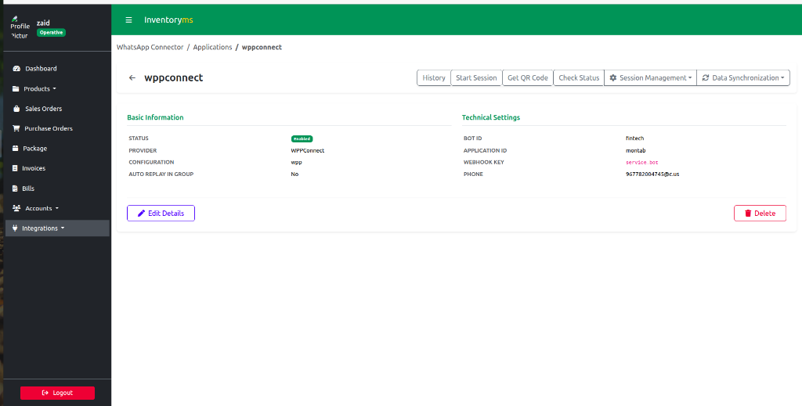
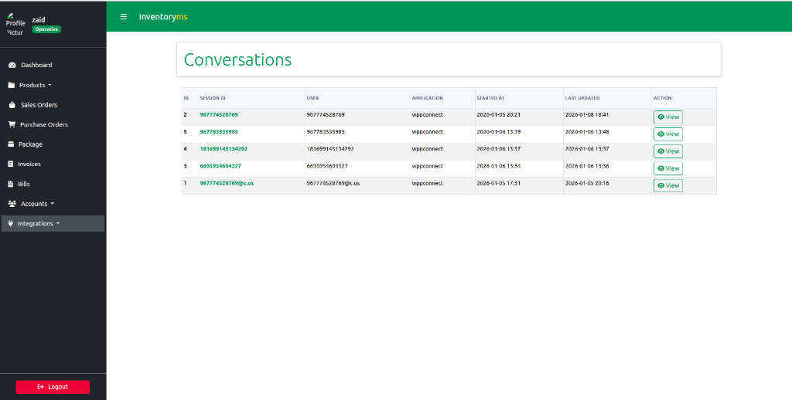
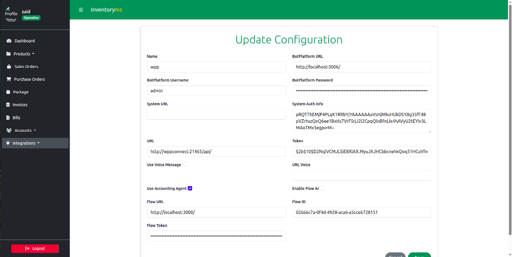

# 📦 SmartStock
### Sales and Inventory Management System

[](https://opensource.org/license/mit)
[](https://www.python.org/downloads/)
[](https://www.docker.com/)

## 🌟 Features
- **Real-time Inventory Tracking**: Manage products, categories, and stock levels.
- **Sales & Purchase Management**: Easy-to-use interfaces for billing and purchasing.
- **AI-Powered WhatsApp Bot**: 
  - Get instant sales summaries.
  - Check debt and top customers.
  - Create purchase orders via natural language.
- **PgAdmin Integration**: Direct database management via a secure UI.
- **Fully Dockerized**: Deployment-ready with Docker Compose profiles.

## 🚀 Quick Start (with Docker)

The easiest way to get started is using Docker Compose.

### 1. Clone the Repository
```bash
git clone https://github.com/zaalmelahi/SmartStock.git
cd SmartStock
```

### 2. Configure Environment
Copy the example environment file and update the variables if necessary:
```bash
cp .env.example .env
```

### 3. Run with Docker Compose
SmartStock uses **Docker Profiles** to manage services efficiently:

*   **Standard (Web + DB):**
    ```bash
    docker compose --profile sales up -d
    ```
*   **Full Suite (Web + DB + WhatsApp Bot):**
    ```bash
    docker compose --profile sales --profile wppconnect up -d
    ```

### 4. Access the Application
- **Web App:** [http://localhost:8000](http://localhost:8000)
- **WhatsApp API:** [http://localhost:21465](http://localhost:21465)

## � Screenshots

### 🤖 AI WhatsApp Assistant
<div align="center">
  
  
  <br>
  
</div>

### 🏢 Web Dashboard & Integration
<details>
  <summary>Click to view system screenshots</summary>

  #### 📊 Inventory Management
  
  
  #### 🔗 WPPConnect Integration
  
  
  
  #### ⚙️ Configuration
  
</details>

## 👥 Author
- [Zaid Al-Melahi](https://github.com/zaalmelahi) - Integration & Dockerization

---
Happy coding! 🚀
